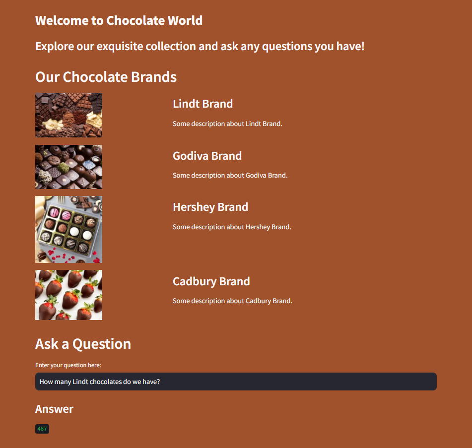

# Natural Language Interface for Database Queries
Leverage the power of cutting-edge language models with our project, which is built on the robust capabilities of Gemini 
Pro and Langchain. This application presents a seamless way for users to interact with a MySQL database through intuitive 
natural language queries. The underlying system adeptly translates these queries into precise SQL commands, executing them 
to retrieve information directly from the database. This intelligent interface is designed to understand complex questions 
and fetch accurate data, simplifying database interactions without the need for SQL expertise.

## Table of Contents

- [Preview](#preview)
- [How It Works](#how-it-works)

## Preview


## Project Highlights
### Intuitive Q&A System
At the core of this project is a sophisticated question-and-answer mechanism powered by state-of-the-art language learning models (LLMs), providing users with the ability to inquire and receive answers in natural language.

### Gemini Pro Integration
Utilizes the advanced capabilities of Gemini Pro to enhance natural language understanding and processing, ensuring high accuracy in user query interpretation.

### Hugging Face Embeddings 
Incorporates embeddings from Hugging Face to capture deep semantic representations of text, facilitating the precise translation of natural language to SQL.

### Streamlit-Powered Interface
Leverages the simplicity and efficiency of Streamlit to create a user-friendly interface, making the interaction with the database both effortless and engaging.

### Langchain Framework
Built upon the Langchain framework, this project is a testament to the framework's versatility in crafting LLM applications that interact with data sources.

### Vector Storage with ChromaDB
Employs ChromaDB for efficient vector storage, ensuring that the retrieval of information is both swift and scalable.

### Few-Shot Learning

Incorporates few-shot learning techniques to train the model with minimal data, demonstrating the system's ability to generalize and understand a wide array of queries.

### Natural Language Queries
The user interface is designed to accept questions framed in everyday language, providing answers with clarity and precision, thus democratizing data access.

## Usage

1. Set up your API key either using system variables or .env file.

2. Run the Streamlit app by executing:
```bash
streamlit run main.py

```

3.The web app will open in your browser where you can ask questions

## Sample Questions
  - How many 100g Lindt Milk Chocolate bars do we have in stock?
  -  What is the total price of the inventory for all Dark Chocolate bars?
  - If we have to sell all the Hershey chocolates today with discounts applied, how much revenue will our store generate (post discounts)?
  - If we sell all the Cadbury chocolates today, how much revenue will our store generate without any discount?
  - How many 50g White Chocolate bars of Godiva do we have?
  
## How it works

### Query Initiation
Users initiate the process by posing a query related to the database in natural language.
### Vector Embedding Retrieval
Employing vector embeddings, the system identifies closely related instances, which then inform the language learning model (LLM) through a few-shot prompting approach.
### Database Schema Interpretation
The system extracts the schema details of the database, providing the LLM with the necessary context for query generation.
### SQL Query Synthesis
Armed with context and examples, the LLM crafts an SQL query that corresponds to the user's initial inquiry.
### Query Execution & Response Delivery
This query is executed against the database, and the retrieved data is processed, formatted, and presented back to the user as a coherent answer.
